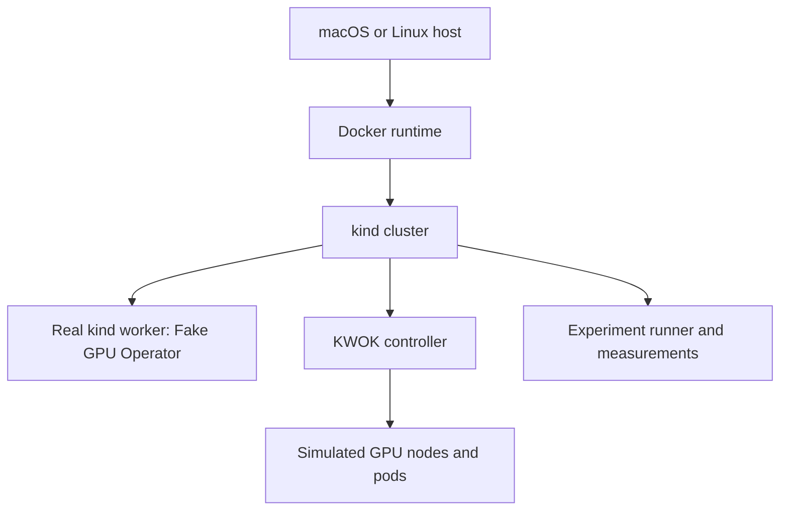

# GPU Scheduling Scale Lab

A reproducible, credential-free lab for studying Kubernetes GPU scheduling and control-plane behavior without physical GPUs. It combines a real container-based kind worker, the Run:ai Fake GPU Operator for functional resource scheduling, and KWOK API simulations for scale. It does **not** benchmark CUDA or real GPU computation.

## Goals and non-goals

Goals are repeatable GPU resource validation, heterogeneous scheduling, saturation, priority/preemption, node-failure and fragmentation experiments, plus sanitized measurements. Non-goals include real CUDA execution, training/inference benchmarking, a custom scheduler, cloud provisioning, firewall/IAM changes, or reading cloud metadata and credentials.

## Architecture



Docker Desktop supplies the Linux container environment on macOS. The real worker executes the Fake GPU Operator. KWOK simulates explicitly marked nodes and pod lifecycles without kubelets; GPU capacity is written directly to Node `capacity` and `allocatable`. KWOK pods do not execute containers or GPU code. Results measure scheduler and control-plane behavior, not CUDA, GPU bandwidth, training throughput, or inference performance.

| Capability | Behavior |
|---|---|
| kind cluster | Real control plane and container-based worker; native AMD64/ARM64 node images |
| KWOK simulation | API-only fake nodes and pod lifecycles |
| GPU scheduling | Real scheduler evaluates synthetic `nvidia.com/gpu` resources |
| Run:ai functional simulation | Runs on the real worker when all operator images support its architecture |
| CUDA performance | Not supported or measured |
| Real training throughput | Not supported or measured |

## macOS quick start

Docker Desktop is recommended. Start Docker Desktop, then run:

```bash
./run.sh preflight
./run.sh bootstrap
./run.sh all --profile smoke
./run.sh status
./run.sh down
```

The scripts do not install Homebrew or Docker Desktop and do not change Docker Desktop settings. They warn below 4 CPUs or 6 GiB RAM; smoke may still work. Run from any directory—the scripts resolve their own location and support spaces in the repository path.

Individual stages also work after bootstrap:

```bash
./run.sh up
./run.sh functional
./run.sh scale --profile smoke
./run.sh status
./run.sh down
```

## Existing OCI or AWS Ubuntu VM

On an already-created Ubuntu 22.04/24.04 OCI Compute or EC2 instance, install Docker Engine yourself and use the same commands. No OCI/AWS credentials or CLIs are used, and no infrastructure is created or changed. See [running on a cloud VM](docs/running-on-cloud-vm.md).

## Supported platforms

| Platform | Status | Notes |
|---|---|---|
| macOS Apple Silicon + Docker Desktop | Primary, architecture-gated | kind/KWOK are native; Fake GPU requires every pinned image to publish ARM64 |
| macOS Intel + Docker Desktop | Primary, architecture-gated | Native AMD64 path expected when manifests are available |
| Ubuntu 22.04/24.04 AMD64 | Secondary | Recommended fallback for the full Fake GPU functional path |
| Ubuntu 22.04/24.04 ARM64 | Secondary, architecture-gated | KWOK native when images permit; Fake GPU checked before install |
| Colima/other Docker-compatible runtimes | Best effort, untested | No support claim |
| Other Linux/cloud provisioning | Future | Not implemented |

Static/unit validation was performed on macOS ARM64. Registry manifests confirmed the pinned kind, KWOK, and enabled Fake GPU component images publish both AMD64 and ARM64 variants. Docker Desktop was installed but stopped, so no cluster smoke run is claimed. Preflight records the actual machine result under `.runtime/image-compatibility.txt`.

## Prerequisites and bootstrap

Required: Bash 3.2+, Docker, curl, a SHA-256 utility, awk/sed/grep/sort/tar, and outbound HTTPS to official release sites and public registries. `bootstrap` downloads pinned kind, kubectl, and Helm binaries into `.runtime/bin`, verifies official checksums, and never writes system directories. All pins are in `versions.env`; floating `latest` tags are prohibited.

The kubeconfig is `.runtime/kubeconfig`, mode `0600`, and is passed explicitly with `KUBECONFIG`. The scripts never read or modify `~/.kube/config`.

## Command reference

| Command | Purpose |
|---|---|
| `help` | Usage and options |
| `preflight` | Dependencies, Docker capacity, daemon and image architecture checks |
| `bootstrap` | Download checksum-verified pinned CLIs |
| `up` | Create kind and install KWOK/Fake GPU components |
| `functional` | Validate one fake GPU on the real kind worker |
| `scale --profile NAME` | Create synthetic workloads and measurements |
| `status` | Nodes, owned pods and latest summary |
| `down` | Scoped cluster/resource cleanup |
| `all --profile NAME` | Preflight through functional and scale stages |

Global options: `--dry-run`, `--platform-mode auto|native|emulated-amd64`, `--confirm-large`, `--batch-size N`, `--timeout N`, and Linux-only `--install-docker` guidance. `auto` prefers native images and fails or skips the functional path safely; it never silently enables emulation. Explicit AMD64 emulation is slow and non-representative.

Non-secret overrides include `CLUSTER_NAME`, `BATCH_SIZE`, `WAIT_TIMEOUT_SECONDS`, `POLL_INTERVAL_SECONDS`, and `PRESERVE_ON_FAILURE`. Profile files contain only `KWOK_NODES`, `SYNTHETIC_PODS`, and `GPU_REQUEST_MAX`.

## Experiment profiles

| Profile | KWOK nodes | Pods | Confirmation |
|---|---:|---:|---|
| smoke | 3 | 10 | No |
| small | 50 | 500 | No |
| medium | 500 | 5,000 | `--confirm-large` |
| large | 1,000 | 10,000 | `--confirm-large` |

Each run prints an impact estimate, uses bounded batches, receives a unique experiment ID and labels every owned resource. Medium and large are never run automatically during development.

## Measurements and interpretation

Results go only to `.runtime/results/<experiment-id>/`: `summary.json`, `pod-scheduling.csv`, `node-summary.csv`, `environment.txt`, and `command.log`, plus API-health and unschedulable-reason diagnostics. Scheduling latency is `PodScheduled.lastTransitionTime - metadata.creationTimestamp`, reported with nearest-rank P50/P95/P99. This includes API admission, scheduler queueing, binding, controller/watch delay, and timestamp resolution; it is not application startup latency.

Use results to compare scheduler throughput, pending behavior, heterogeneous placement and API/control-plane pressure. Do not infer physical GPU performance. Failure diagnostics are preserved by default.

## Cleanup and troubleshooting

`./run.sh down` validates the exact cluster name, removes only known namespaces and labeled KWOK nodes, deletes only that kind cluster, and removes the project kubeconfig. Downloaded tools and diagnostics remain for investigation. It never deletes all clusters, namespaces, Docker containers, `$HOME`, `/`, `/tmp`, or the repository.

- Docker daemon unavailable: start Docker Desktop/Engine; nothing changes Docker settings.
- Image incompatible: inspect `.runtime/image-compatibility.txt`; use native KWOK or an existing AMD64 Ubuntu VM. Emulate only explicitly.
- GPU capacity absent: inspect Fake GPU pods and worker labels; functional validation fails rather than claiming success.
- Pending KWOK pod: verify the fake taint/toleration, selectors, GPU model and allocatable capacity.
- Large run failed: preserve `.runtime/results/<id>` and run `down` when finished diagnosing.

## Security and credential policy

The project needs no cloud credentials and never queries OCI/AWS metadata. Do not place tokens, profiles, kubeconfigs, SSH material, Docker credentials, private keys, account IDs, OCIDs, or secret `.env` files here. Runtime data, downloaded tools, kubeconfig, logs, results, and certificates are ignored. No service or port-forward is exposed publicly; future optional forwarding must bind `127.0.0.1`.

See [architecture](docs/architecture.md), [methodology](docs/experiment-methodology.md), [limitations](docs/limitations.md), and [cloud VM operation](docs/running-on-cloud-vm.md).
